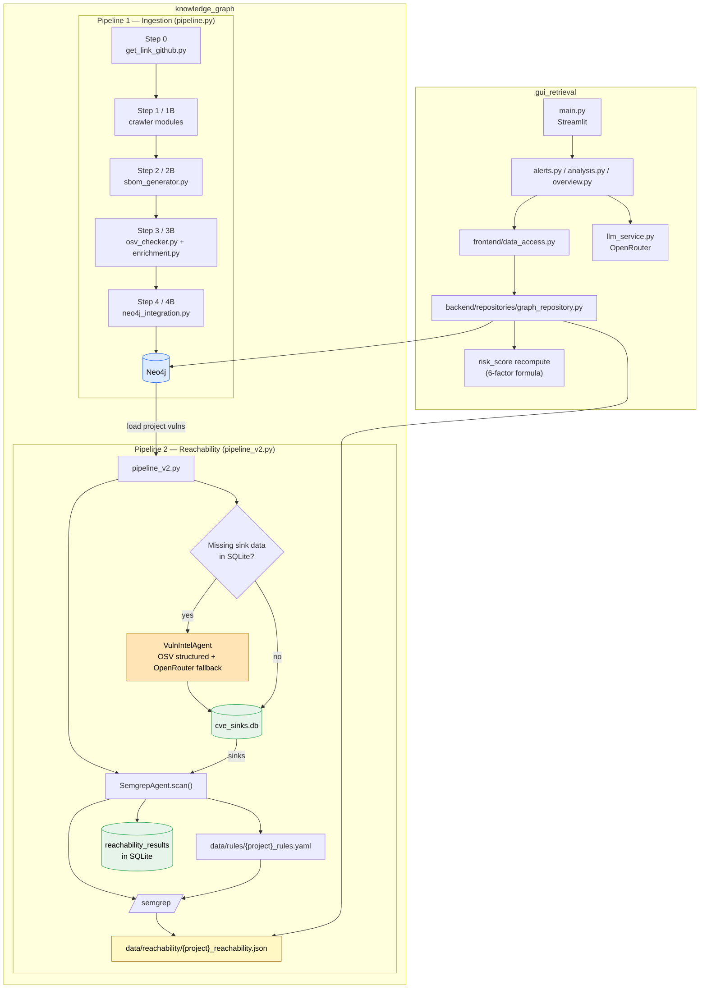

# Phân Tích Codebase: Trạng Thái Hiện Tại

Tài liệu này mô tả **hiện trạng đang chạy trong workspace chính**:

- `knowledge_graph/` là pipeline ingestion + reachability
- `gui_retrieval/` là dashboard Streamlit

---

## 1. Tổng quan kiến trúc

Hệ thống hiện tại có 2 phần chính:

```text
knowledge_graph/
  ├─ pipeline.py       -> ingest repo/SBOM/vulnerability vào Neo4j
  └─ pipeline_v2.py    -> reachability scan bằng Semgrep + sink intelligence

gui_retrieval/
  └─ main.py           -> Streamlit dashboard đọc Neo4j + reachability JSON
```

Luồng dữ liệu ở mức cao:

```text
Repo source
  -> SBOM
  -> Vulnerability enrichment
  -> Neo4j
  -> pipeline_v2.py đọc vuln list từ Neo4j
  -> cve_sinks.db + Semgrep rules
  -> reachability JSON
  -> GUI recompute risk_score và hiển thị
```

---

## 2. knowledge_graph: Luồng chính đang hoạt động

### 2.1 Entry points

| File | Vai trò hiện tại |
|------|------------------|
| `knowledge_graph/pipeline.py` | Orchestrator ingestion chính cho flow repo thường và flow vulnerable repo |
| `knowledge_graph/pipeline_v2.py` | Reachability pipeline: đọc vuln từ Neo4j, bảo đảm sink data, chạy Semgrep, lưu `reachability/*.json` |

### 2.2 Core modules thực sự đang được dùng

| File / thư mục | Vai trò |
|----------------|---------|
| `knowledge_graph/modules/get_link/get_link_github.py` | Step 0: thu thập link repo |
| `knowledge_graph/modules/crawler/github_crawler.py` | Step 1: crawl/clone repo thường |
| `knowledge_graph/modules/crawler/dependabot_vuln_crawler.py` | Step 1B: crawl vulnerable repos từ ground-truth |
| `knowledge_graph/modules/sbom/sbom_generator.py` | Step 2/2B: sinh CycloneDX SBOM |
| `knowledge_graph/modules/vulnerability/osv_checker.py` | Step 3/3B: query OSV theo batch |
| `knowledge_graph/modules/vulnerability/enrichment.py` | Enrich thêm CVSS, EPSS, KEV và metadata liên quan |
| `knowledge_graph/modules/graph/neo4j_integration.py` | Step 4/4B: import dữ liệu vào Neo4j |
| `knowledge_graph/modules/utils/paths.py` | Path constants dùng xuyên suốt pipeline |
| `knowledge_graph/modules/utils/sbom_parser.py` | Parse CycloneDX JSON, dependency graph, depth |
| `knowledge_graph/modules/utils/purl_utils.py` | Parse / normalize purl và ecosystem |

### 2.3 Agent modules của flow reachability

| File | Vai trò |
|------|---------|
| `knowledge_graph/modules/agents/vuln_intel_agent.py` | Fetch OSV advisory, ưu tiên structured extraction, fallback sang LLM qua OpenRouter |
| `knowledge_graph/modules/agents/semgrep_agent.py` | Sinh rule YAML theo sink, chạy Semgrep, parse findings thành reachability verdict |
| `knowledge_graph/modules/agents/sink_db.py` | SQLite layer cho `cve_sinks.db` và `reachability_results` |
| `knowledge_graph/modules/agents/rate_limiter.py` | Rate limiting cho external API calls |
| `knowledge_graph/modules/agents/config.py` | Config agent, endpoint, model, rate limit |

---

## 3. pipeline.py: Ingestion flow hiện tại

`knowledge_graph/pipeline.py` hiện vẫn là orchestrator ingestion chính và có đủ các nhánh:

- Step 0: lấy link repo
- Step 1: crawl repo thường
- Step 1B: crawl vulnerable repo
- Step 2: SBOM cho repo thường
- Step 2B: SBOM cho vulnerable repo
- Step 3: vulnerability check + enrichment cho repo thường
- Step 3B: vulnerability check + enrichment cho vulnerable repo
- Step 4: import Neo4j cho repo thường
- Step 4B: import Neo4j cho vulnerable repo

Điểm cần lưu ý:

- Flow vulnerable repo hiện là một phần chính thức của `pipeline.py`, không còn là tiện ích ngoài lề
- Các file output nằm dưới `knowledge_graph/data/` theo từng nhóm: `sboms/`, `vulnerabilities/`, `vulnerable_sboms/`, `vulnerable_vulnerabilities/`, `metadata/`

---

## 4. pipeline_v2.py: Reachability flow hiện tại

### 4.1 Mục tiêu

`pipeline_v2.py` dùng để xác định một CVE trong project là:

- `confirmed_reachable`
- `likely_reachable`
- `likely_unreachable`
- hoặc `no_sink_data`

### 4.2 Luồng thực thi hiện tại

```text
pipeline_v2.py
  -> load_project_vulns() từ Neo4j
  -> missing_vulns() kiểm tra CVE thiếu sink trong SQLite
  -> nếu thiếu và không dùng --no-ai:
       auto_extract_sinks()
         -> VulnIntelAgent
         -> OSV structured fields trước
         -> OpenRouter fallback nếu cần
         -> insert_sinks() vào cve_sinks.db
  -> SemgrepAgent.scan()
       -> get_sinks_for_vulns()
       -> generate_rules()
       -> run_semgrep()
       -> parse_findings()
  -> agent.save(results)
       -> ghi data/reachability/{project}_reachability.json
       -> ghi SQLite reachability_results
```

### 4.3 Hai cách populate sink data

Hiện tại có **2 cách hợp lệ** để nạp sink data:

1. Tự động trong `pipeline_v2.py`
   - qua `auto_extract_sinks()`
   - gọi `VulnIntelAgent`
   - dùng OSV trước, LLM sau

2. Import batch AI có sẵn
   - dùng `pipeline_v2.py --import-ai data/ai_output/batch_XXX.json`
   - `sink_db.load_ai_json_output()` sẽ insert vào `cve_sinks.db`

### 4.4 Semgrep rule generation hiện tại

`semgrep_agent.py` hiện **không còn** sinh "1 rule / sink function" theo nghĩa cũ. Mỗi sink có thể sinh nhiều rule theo tier:

- rule direct call
- rule import / require của package

Từ đó parser phân loại verdict như sau:

- `confirmed_reachable`: có direct call match
- `likely_reachable`: không có direct call nhưng có import / require match
- `likely_unreachable`: đã quét nhưng không có match
- `no_sink_data`: không có sink data cho CVE

---

## 5. Risk score: Công thức hiện đang dùng trên GUI

Risk score đang được dashboard tính lại ở:

- `gui_retrieval/backend/repositories/graph_repository.py`
- `gui_retrieval/frontend/views/alerts.py` chỉ hiển thị lại breakdown theo đúng công thức backend

### 5.1 Công thức hiện tại

```text
Risk = 100 * (
    0.25 * S_sev +
    0.25 * S_exp +
    0.15 * S_scope +
    0.35 * S_reach
)
```

### 5.2 Ý nghĩa tham số

| Tham số | Nguồn |
|--------|-------|
| `S_sev` | `cvss / 10.0` từ Neo4j |
| `S_exp` | `1.0` nếu KEV, ngược lại dùng EPSS |
| `S_scope` | scope của package trong SBOM |
| `S_reach` | mapping từ reachability verdict |

### 5.3 Reachability mapping hiện dùng để recompute risk

Trong `graph_repository.py`, GUI đang chuẩn hóa verdict thành:

- `confirmed_reachable` -> `1.0`
- `likely_reachable` -> `0.7`
- `no_sink_data` -> `0.5`
- `likely_unreachable` -> `0.3`

Ngoài ra:

- Cypher query dùng placeholder `0.15 * 0.5` cho reachability trước khi Python chèn verdict thực
- sau khi load `reachability.json`, backend recompute lại `risk_score`
- danh sách alerts sau đó được sort lại theo `risk_score` mới

---

## 6. gui_retrieval: Luồng chính hiện tại

### 6.1 Entry point

| File | Vai trò |
|------|---------|
| `gui_retrieval/main.py` | Streamlit app chính, render 3 tab |

3 tab hiện tại:

- `Security Alerts`
- `LLM Analysis`
- `Overview`

### 6.2 Backend

| File | Vai trò |
|------|---------|
| `gui_retrieval/backend/config.py` | Env vars và registry scenario |
| `gui_retrieval/backend/graph_service.py` | Neo4j driver wrapper |
| `gui_retrieval/backend/repositories/graph_repository.py` | Cypher queries, load reachability, recompute risk score |
| `gui_retrieval/backend/retrieval_scenarios.py` | Scenario -> query bundle cho phần LLM analysis |
| `gui_retrieval/backend/services/evidence_service.py` | Chuẩn hóa evidence records |
| `gui_retrieval/backend/services/prompt_service.py` | Build prompt context |
| `gui_retrieval/backend/services/llm_service.py` | Orchestrate retrieval + gọi OpenRouter |

### 6.3 Frontend

| File | Vai trò |
|------|---------|
| `gui_retrieval/frontend/data_access.py` | lớp cache `@st.cache_data` giữa UI và backend |
| `gui_retrieval/frontend/views/alerts.py` | alert list + detail page + risk breakdown |
| `gui_retrieval/frontend/views/analysis.py` | LLM analysis tab |
| `gui_retrieval/frontend/views/overview.py` | project overview tab |
| `gui_retrieval/frontend/components/ui_components.py` | helper render UI dùng chung |
| `gui_retrieval/frontend/styles.py` | CSS của dashboard |

### 6.4 Scenarios hiện có

Phần LLM hiện có:

- 7 scenario backend định nghĩa trong `retrieval_scenarios.py`
- cộng thêm 1 mode `custom` được thêm ở `llm_service.get_scenarios()`

Các scenario backend hiện có:

- `dev_explain`
- `manager_brief`
- `triage_queue`
- `explainability_mode`
- `multi_audience`
- `project_overview`
- `arch_impact`

---

## 7. Data artifacts quan trọng trong workspace

Các file dữ liệu chính đang hiện hữu:

| Đường dẫn | Ý nghĩa |
|----------|---------|
| `knowledge_graph/data/cve_sinks.db` | SQLite lưu advisory, sink metadata, reachability results |
| `knowledge_graph/data/reachability/*.json` | Kết quả quét Semgrep theo project |
| `knowledge_graph/data/ai_output/*.json` | Batch AI output để import sink data |
| `knowledge_graph/data/sboms/` | SBOM của repo thường |
| `knowledge_graph/data/vulnerabilities/` | Vulnerability data của repo thường |
| `knowledge_graph/data/vulnerable_sboms/` | SBOM của vulnerable repos |
| `knowledge_graph/data/vulnerable_vulnerabilities/` | Vulnerability data của vulnerable repos |
| `knowledge_graph/data/metadata/` | metadata, import status, repo list |

---

## 8. Sơ đồ luồng dữ liệu



---

## 9. Tóm tắt ngắn

Nếu cần định vị nhanh code đang thật sự ảnh hưởng hệ thống hiện tại:

- Ingestion: `knowledge_graph/pipeline.py`
- Reachability: `knowledge_graph/pipeline_v2.py`
- Sink intelligence: `knowledge_graph/modules/agents/vuln_intel_agent.py`
- Semgrep scan: `knowledge_graph/modules/agents/semgrep_agent.py`
- Risk score backend: `gui_retrieval/backend/repositories/graph_repository.py`
- Alerts UI: `gui_retrieval/frontend/views/alerts.py`
- LLM orchestration: `gui_retrieval/backend/services/llm_service.py`
