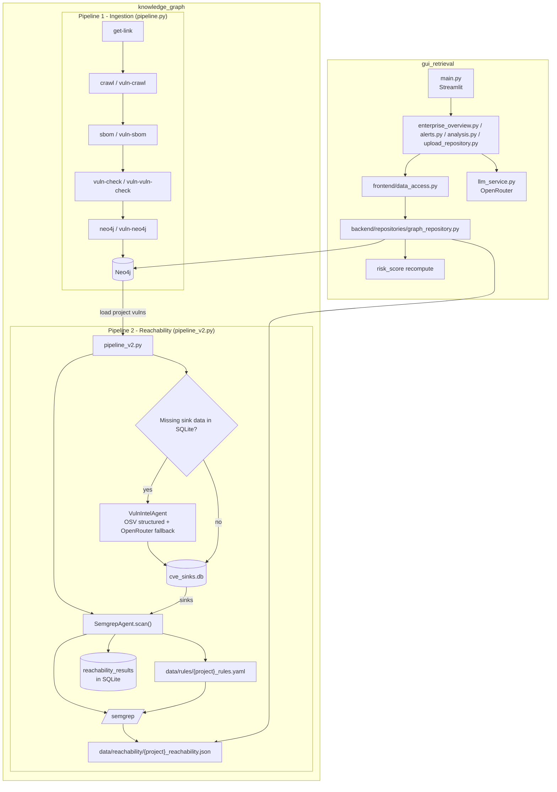

# Phân Tích Codebase: Trạng Thái Hiện Tại

Tài liệu này mô tả hiện trạng đang chạy trong workspace chính:

- `knowledge_graph/` là pipeline ingestion + reachability
- `gui_retrieval/` là dashboard Streamlit

---

## 1. Tổng quan kiến trúc

Hệ thống hiện tại có 2 phần chính:

```text
knowledge_graph/
  |- pipeline.py       -> ingest repo/SBOM/vulnerability vào Neo4j
  |- pipeline_v2.py    -> reachability scan bằng Semgrep + sink intelligence

gui_retrieval/
  |- main.py           -> Streamlit dashboard đọc Neo4j + reachability data
```

Luồng dữ liệu mức cao:

```text
Repo source
  -> SBOM
  -> Vulnerability enrichment
  -> Neo4j
  -> pipeline_v2.py đọc vuln list từ Neo4j
  -> cve_sinks.db + Semgrep rules
  -> reachability JSON / SQLite
  -> GUI recompute risk_score và hiển thị
```

---

## 2. knowledge_graph: Luồng chính đang hoạt động

### 2.1 Entry points

| File | Vai trò hiện tại |
|------|------------------|
| `knowledge_graph/pipeline.py` | Orchestrator ingestion chính cho flow repo thường, vulnerable repo, hoặc cả hai |
| `knowledge_graph/pipeline_v2.py` | Reachability pipeline: đọc vuln từ Neo4j, bảo đảm sink data, chạy Semgrep, lưu `reachability/*.json` |
| `knowledge_graph/run_semgrep_sync_from_neo4j.py` | Batch runner: lấy toàn bộ `Project.full_name` từ Neo4j rồi gọi `pipeline_v2.py` cho từng project |
| `knowledge_graph/run_all_reachability.sh` | Shell runner cho batch reachability, hiện thiên về quét các Python project trong Neo4j |
| `knowledge_graph/re_enrich_neo4j_vulns.py` | Script backfill / refresh metadata cho các node `Vulnerability` đã có trong Neo4j |

### 2.2 Core modules thực sự đang được dùng

| File / thư mục | Vai trò |
|----------------|---------|
| `knowledge_graph/modules/get_link/get_link_github.py` | Step `get-link`: thu thập link repo |
| `knowledge_graph/modules/crawler/github_crawler.py` | Step `crawl`: crawl/clone repo thường |
| `knowledge_graph/modules/crawler/dependabot_vuln_crawler.py` | Step `vuln-crawl`: crawl vulnerable repos từ ground-truth |
| `knowledge_graph/modules/sbom/sbom_generator.py` | Step `sbom` / `vuln-sbom`: sinh CycloneDX SBOM |
| `knowledge_graph/modules/vulnerability/osv_checker.py` | Step `vuln-check` / `vuln-vuln-check`: query OSV theo batch |
| `knowledge_graph/modules/vulnerability/enrichment.py` | Enrich thêm CVSS, EPSS, KEV và metadata liên quan |
| `knowledge_graph/modules/graph/neo4j_integration.py` | Step `neo4j` / `vuln-neo4j`: import dữ liệu vào Neo4j |
| `knowledge_graph/modules/utils/paths.py` | Path constants dùng xuyên suốt pipeline |
| `knowledge_graph/modules/utils/sbom_parser.py` | Parse CycloneDX JSON, dependency graph, depth |
| `knowledge_graph/modules/utils/purl_utils.py` | Parse / normalize purl và ecosystem |

### 2.3 Agent modules của flow reachability

| File | Vai trò |
|------|---------|
| `knowledge_graph/modules/agents/vuln_intel_agent.py` | Fetch OSV advisory, ưu tiên structured extraction, fallback sang LLM qua OpenRouter |
| `knowledge_graph/modules/agents/semgrep_agent.py` | Sinh rule YAML theo sink, chạy Semgrep, parse findings thành reachability verdict |
| `knowledge_graph/modules/agents/sink_db.py` | SQLite layer cho `cve_sinks.db` và `reachability_results` |
| `knowledge_graph/modules/agents/rate_limiter.py` | Rate limiting cho external API calls |
| `knowledge_graph/modules/agents/config.py` | Config agent, endpoint, model, rate limit |
| `knowledge_graph/modules/agents/sink_enricher.py` | Offline sink enrichment từ advisory + patch references, ghi bổ sung vào `cve_sinks.db` |

---

## 3. pipeline.py: Ingestion flow hiện tại

`knowledge_graph/pipeline.py` vẫn là orchestrator ingestion chính, nhưng CLI đã được dọn lại theo 2 hướng sử dụng rõ ràng:

- full flow bằng `--flow main|vulnerable|both`
- chạy từng bước bằng `--steps ...`

### 3.1 Các step hiện có

- `get-link`
- `crawl`
- `vuln-crawl`
- `sbom`
- `vuln-sbom`
- `vuln-check`
- `vuln-vuln-check`
- `neo4j`
- `vuln-neo4j`

### 3.2 Full flow hiện tại

`pipeline.py` hỗ trợ 3 flow:

- `main`: repo thường
- `vulnerable`: vulnerable repo từ ground-truth
- `both`: chạy cả hai flow

Mặc định full run là `--flow main`, nên sẽ không tự động chạy vulnerable flow nếu không yêu cầu rõ.

### 3.3 Demo CLI hiện tại

Tất cả command nên chạy từ trong thư mục `knowledge_graph/`:

```bash
cd knowledge_graph
python3 pipeline.py --help
```

Demo 1 repo nhỏ, tách riêng database demo:

```bash
cd knowledge_graph
python3 pipeline.py \
  --demo-safe \
  --demo-label react_native_demo \
  --single-repo "DanBurbach/React-Native-Basic" \
  --steps crawl sbom vuln-check neo4j \
  --neo4j-uri bolt://host.docker.internal:7689
```

Full main flow:

```bash
cd knowledge_graph
python3 pipeline.py \
  --flow main \
  --languages JavaScript Python \
  --max-per-language 25 \
  --neo4j-uri bolt://localhost:7689
```

Full vulnerable flow:

```bash
cd knowledge_graph
python3 pipeline.py \
  --flow vulnerable \
  --vulnerable-groundtruth-file data/metadata/dependabot_groundtruth.json \
  --neo4j-uri bolt://localhost:7689
```

### 3.4 Điểm cần lưu ý

- Flow vulnerable repo vẫn là một phần chính thức của `pipeline.py`
- CLI cũ dựa trên `--skip-*` đã được loại bỏ
- `--single-repo` dùng để tạo repo-links file tạm cho demo 1 repo
- `--demo-safe` dùng để tách tên database demo, giảm nguy cơ ảnh hưởng data đang có
- Các file output vẫn nằm dưới `knowledge_graph/data/` theo từng nhóm: `sboms/`, `vulnerabilities/`, `vulnerable_sboms/`, `vulnerable_vulnerabilities/`, `metadata/`

### 3.5 Các script phụ mới quanh ingestion / batch run

Ngoài `pipeline.py`, hiện codebase còn có thêm một số script hỗ trợ:

- `knowledge_graph/run_semgrep_sync_from_neo4j.py`
  - đọc danh sách project trực tiếp từ Neo4j
  - dựng local repo path từ `data/metadata/vulnerable_repos_metadata.json` và `data/metadata/repos_metadata.json`
  - gọi `pipeline_v2.py` cho từng project
  - ghi tổng kết vào `data/reachability/semgrep_sync_summary.json`

- `knowledge_graph/run_all_reachability.sh`
  - shell wrapper để chạy batch reachability trên Linux
  - hiện filter theo `Project {language: "Python"}` trong Neo4j
  - map `owner/repo` sang thư mục `data/vulnerable_repos/owner_repo__commit`

- `knowledge_graph/re_enrich_neo4j_vulns.py`
  - đọc toàn bộ `Vulnerability.id` từ Neo4j
  - gọi lại logic enrichment qua `OSVChecker`
  - refresh aliases / metadata trên các node vulnerability đã tồn tại

---

## 4. pipeline_v2.py: Reachability flow hiện tại

### 4.1 Mục tiêu

`pipeline_v2.py` dùng để xác định một CVE trong project là:

- `confirmed_reachable`
- `likely_reachable`
- `likely_unreachable`
- hoặc `no_sink_data`

### 4.2 Luồng thực thi hiện tại

```text
pipeline_v2.py
  -> load_project_vulns() từ Neo4j
  -> missing_vulns() kiểm tra CVE thiếu sink trong SQLite
  -> nếu thiếu và không dùng --no-ai:
       auto_extract_sinks()
         -> VulnIntelAgent
         -> OSV structured fields trước
         -> OpenRouter fallback nếu cần
         -> insert_sinks() vào cve_sinks.db
  -> SemgrepAgent.scan()
       -> get_sinks_for_vulns()
       -> generate_rules()
       -> run_semgrep()
       -> parse_findings()
  -> agent.save(results)
       -> ghi data/reachability/{project}_reachability.json
       -> ghi SQLite reachability_results
```

### 4.3 Hai cách populate sink data

Hiện tại có 2 cách hợp lệ để nạp sink data:

1. Tự động trong `pipeline_v2.py`
   - qua `auto_extract_sinks()`
   - gọi `VulnIntelAgent`
   - dùng OSV trước, LLM sau

2. Import batch AI có sẵn
   - dùng `pipeline_v2.py --import-ai data/ai_output/batch_XXX.json`
   - `sink_db.load_ai_json_output()` sẽ insert vào `cve_sinks.db`

3. Offline enrichment bằng script riêng
   - dùng `knowledge_graph/modules/agents/sink_enricher.py`
   - target chính là các CVE đang có `no_sink_data` trong `reachability_results`
   - tận dụng thêm GitHub patch và GHSA advisory để suy ra sink rồi ghi vào `cve_sinks.db`

### 4.4 Semgrep rule generation hiện tại

`semgrep_agent.py` hiện không còn sinh "1 rule / sink function" theo nghĩa cũ. Mỗi sink có thể sinh nhiều rule theo tier:

- rule direct call
- rule import / require của package

Từ đó parser phân loại verdict như sau:

- `confirmed_reachable`: có direct call match
- `likely_reachable`: không có direct call nhưng có import / require match
- `likely_unreachable`: đã quét nhưng không có match
- `no_sink_data`: không có sink data cho CVE

### 4.5 CLI hiện tại

```bash
cd knowledge_graph
python3 pipeline_v2.py --help
```

Full reachability scan:

```bash
cd knowledge_graph
python3 pipeline_v2.py \
  --project "DanBurbach/React-Native-Basic" \
  --repo "data/vulnerable_repos/DanBurbach_React-Native-Basic__1dd9339c46" \
  --neo4j-uri "bolt://host.docker.internal:7689" \
  --save
```

Coverage check:

```bash
cd knowledge_graph
python3 pipeline_v2.py \
  --project "DanBurbach/React-Native-Basic" \
  --neo4j-uri "bolt://host.docker.internal:7689" \
  --check-coverage
```

### 4.6 Batch reachability hiện tại

Ngoài cách chạy từng project bằng `pipeline_v2.py`, hiện có thêm 2 đường batch:

1. Python batch runner:

```bash
cd knowledge_graph
python3 run_semgrep_sync_from_neo4j.py \
  --neo4j-uri bolt://host.docker.internal:7689 \
  --neo4j-user neo4j \
  --neo4j-password password
```

2. Shell batch runner:

```bash
cd knowledge_graph
./run_all_reachability.sh bolt://host.docker.internal:7689
```

Khác biệt chính:

- `run_semgrep_sync_from_neo4j.py` tổng quát hơn, lấy toàn bộ project trong Neo4j
- `run_all_reachability.sh` hiện đang thiên về project Python và tìm repo path theo naming convention trong `data/vulnerable_repos/`

---

## 5. Risk score: Công thức hiện đang dùng trên GUI

Risk score đang được dashboard tính lại ở:

- `gui_retrieval/backend/repositories/graph_repository.py`
- `gui_retrieval/frontend/views/alerts.py` chỉ hiển thị lại breakdown theo đúng công thức backend

### 5.1 Công thức hiện tại

```text
Risk = 100 * (
    0.25 * S_sev +
    0.25 * S_exp +
    0.15 * S_scope +
    0.35 * S_reach
)
```

### 5.2 Ý nghĩa tham số

| Tham số | Nguồn |
|--------|-------|
| `S_sev` | `cvss / 10.0` từ Neo4j |
| `S_exp` | `1.0` nếu KEV, ngược lại dùng EPSS |
| `S_scope` | scope của package trong SBOM |
| `S_reach` | mapping từ reachability verdict |

### 5.3 Reachability mapping hiện dùng để recompute risk

Trong `graph_repository.py`, GUI đang chuẩn hóa verdict thành:

- `confirmed_reachable` -> `1.0`
- `likely_reachable` -> `0.7`
- `no_sink_data` -> `0.5`
- `likely_unreachable` -> `0.3`

Ngoài ra:

- Cypher query dùng placeholder cho reachability trước khi Python chèn verdict thật
- sau khi load reachability từ SQLite hoặc JSON, backend recompute lại `risk_score`
- danh sách alerts sau đó được sort lại theo `risk_score` mới

---

## 6. gui_retrieval: Luồng chính hiện tại

### 6.1 Entry point

| File | Vai trò |
|------|---------|
| `gui_retrieval/main.py` | Streamlit app chính, render 3 tab mức cao: enterprise overview, repository analysis, upload repository |

3 tab mức cao hiện tại:

- `Enterprise Security Overview`
- `Repository Analysis`
- `Upload Repository`

### 6.2 Backend

| File | Vai trò |
|------|---------|
| `gui_retrieval/backend/config.py` | Env vars và registry scenario |
| `gui_retrieval/backend/graph_service.py` | Neo4j driver wrapper |
| `gui_retrieval/backend/repositories/graph_repository.py` | Cypher queries, load reachability, recompute risk score |
| `gui_retrieval/backend/retrieval_scenarios.py` | Scenario -> query bundle cho phần LLM analysis |
| `gui_retrieval/backend/services/evidence_service.py` | Chuẩn hóa evidence records |
| `gui_retrieval/backend/services/prompt_service.py` | Build prompt context |
| `gui_retrieval/backend/services/llm_service.py` | Orchestrate retrieval + gọi OpenRouter |
| `gui_retrieval/backend/services/repo_pipeline_service.py` | Full single-repo ingestion từ UI |

### 6.3 Frontend

| File | Vai trò |
|------|---------|
| `gui_retrieval/frontend/data_access.py` | Lớp cache `@st.cache_data` giữa UI và backend |
| `gui_retrieval/frontend/views/alerts.py` | alert list + detail page + risk breakdown |
| `gui_retrieval/frontend/views/analysis.py` | LLM analysis tab |
| `gui_retrieval/frontend/views/enterprise_overview.py` | enterprise-wide dashboard tab |
| `gui_retrieval/frontend/views/upload_repository.py` | UI trigger cho full single-repo ingest pipeline |
| `gui_retrieval/frontend/components/ui_components.py` | helper render UI dùng chung |
| `gui_retrieval/frontend/styles.py` | CSS của dashboard |

### 6.4 Ingest panel trong GUI

Panel `Ingest New Repository` hiện tại gọi:

```text
repo input
  -> clone / update
  -> SBOM generation
  -> OSV check
  -> Neo4j import
  -> Semgrep reachability
  -> dashboard refresh
```

Nó không gọi trực tiếp `knowledge_graph/pipeline.py`, mà sử dụng `gui_retrieval/backend/services/repo_pipeline_service.py` để chạy single-repo flow.

So với trước, `repo_pipeline_service.py` hiện còn có thêm:

- parse GitHub URL / `owner/repo`
- clone hoặc update repo local
- xử lý `git safe.directory` để tránh lỗi ownership trong môi trường container / sandbox
- lấy metadata ngôn ngữ từ GitHub API trước, rồi mới fallback sang heuristic local

---

## 7. Data artifacts quan trọng trong workspace

| Đường dẫn | Ý nghĩa |
|----------|---------|
| `knowledge_graph/data/cve_sinks.db` | SQLite lưu advisory, sink metadata, reachability results |
| `knowledge_graph/data/reachability/*.json` | Kết quả quét Semgrep theo project |
| `knowledge_graph/data/ai_output/*.json` | Batch AI output để import sink data |
| `knowledge_graph/data/sboms/` | SBOM của repo thường |
| `knowledge_graph/data/vulnerabilities/` | Vulnerability data của repo thường |
| `knowledge_graph/data/vulnerable_sboms/` | SBOM của vulnerable repos |
| `knowledge_graph/data/vulnerable_vulnerabilities/` | Vulnerability data của vulnerable repos |
| `knowledge_graph/data/metadata/` | metadata, import status, repo list |
| `knowledge_graph/data/metadata/neo4j_imported_repos_*.json` | file trạng thái import Neo4j theo URI / database |
| `knowledge_graph/data/rules/*.yaml` | Semgrep rules được generate cho từng project |
| `knowledge_graph/data/reachability/semgrep_sync_summary.json` | summary của batch reachability run |

---

## 8. Sơ đồ luồng dữ liệu



---

## 9. Tóm tắt ngắn

Nếu cần định vị nhanh code đang thật sự ảnh hưởng hệ thống hiện tại:

- Ingestion: `knowledge_graph/pipeline.py`
- Reachability: `knowledge_graph/pipeline_v2.py`
- Batch reachability: `knowledge_graph/run_semgrep_sync_from_neo4j.py`
- Neo4j vulnerability refresh: `knowledge_graph/re_enrich_neo4j_vulns.py`
- Single-repo ingest từ UI: `gui_retrieval/backend/services/repo_pipeline_service.py`
- Sink intelligence: `knowledge_graph/modules/agents/vuln_intel_agent.py`
- Offline sink enrichment: `knowledge_graph/modules/agents/sink_enricher.py`
- Semgrep scan: `knowledge_graph/modules/agents/semgrep_agent.py`
- Risk score backend: `gui_retrieval/backend/repositories/graph_repository.py`
- Alerts UI: `gui_retrieval/frontend/views/alerts.py`
- LLM orchestration: `gui_retrieval/backend/services/llm_service.py`
