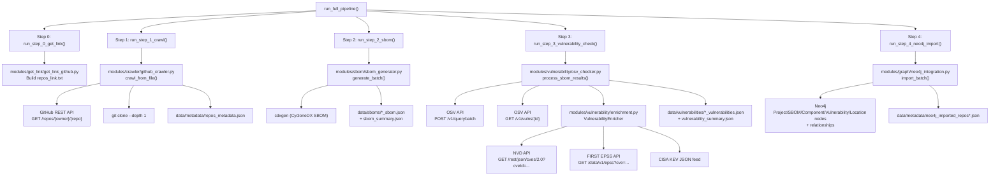
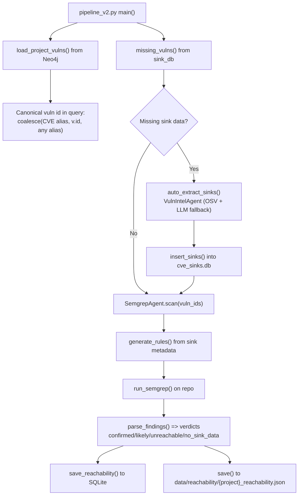
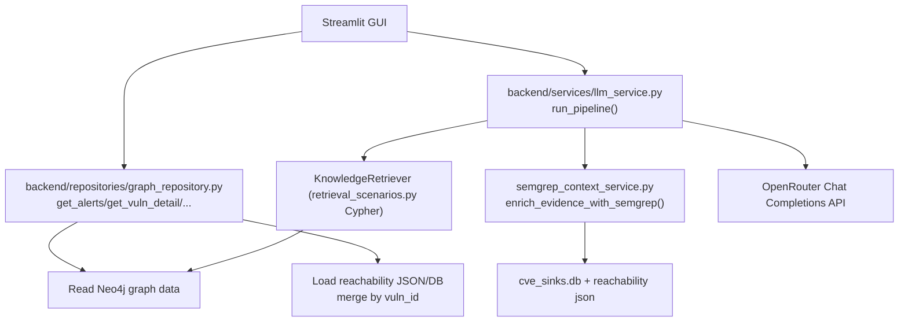

# Pipeline End-to-End Diagram (Current Implementation)

## 1) Main Batch Pipeline (`knowledge_graph/pipeline.py`)

## 2) Reachability Pipeline (`knowledge_graph/pipeline_v2.py`)

## 3) GUI Read/LLM Flow (`gui_retrieval`)

## 4) CVE Mapping Logic (Where IDs Become “CVE” vs “GHSA”)

### A. During OSV ingest (`osv_checker.py`)
- Vulnerability object identity is stored as `vuln.id` from OSV detail.
- If OSV detail `id` is `GHSA-...`, then Neo4j node `Vulnerability.id` is GHSA.
- CVE aliases are taken from `vuln.aliases` (if present) and stored into `v.aliases`.
- Enrichment (`EPSS/CVSS/KEV`) is only attempted when at least one CVE is available in aliases.

### B. During query/render (`graph_repository.py`, `pipeline_v2.py`, `retrieval_scenarios.py`)
- Canonical vuln id is resolved with:
  - `head(alias STARTS WITH 'CVE-')`
  - fallback `v.id`
  - fallback `head(v.aliases)`
- Therefore:
  - If a CVE alias exists, UI/pipeline tends to show CVE.
  - If no CVE alias exists, system shows GHSA id.

## 5) External APIs / Tools Used

- GitHub REST API: `https://api.github.com/repos/{owner}/{repo}`
- Git (clone/fetch)
- cdxgen (CycloneDX SBOM generator)
- OSV querybatch: `https://api.osv.dev/v1/querybatch`
- OSV vuln detail: `https://api.osv.dev/v1/vulns/{id}`
- NVD CVE API: `https://services.nvd.nist.gov/rest/json/cves/2.0`
- FIRST EPSS API: `https://api.first.org/data/v1/epss`
- CISA KEV feed:
  - `https://raw.githubusercontent.com/cisagov/kev-data/main/known_exploited_vulnerabilities.json`
  - fallback `https://www.cisa.gov/sites/default/files/feeds/known_exploited_vulnerabilities.json`
- Semgrep CLI
- OpenRouter Chat Completions (LLM layer)

## 6) Persisted Artifacts by Stage

- Crawl metadata: `data/metadata/repos_metadata.json`
- SBOM: `data/sboms/*_sbom.json` + `sbom_summary.json`
- Vulnerability cache: `data/vulnerabilities/*_vulnerabilities.json` + `vulnerability_summary.json`
- Graph import ledger: `data/metadata/neo4j_imported_repos*.json`
- Sink/reachability DB: `data/cve_sinks.db`
- Semgrep rules: `data/rules/*_rules.yaml`
- Reachability results: `data/reachability/*_reachability.json`
